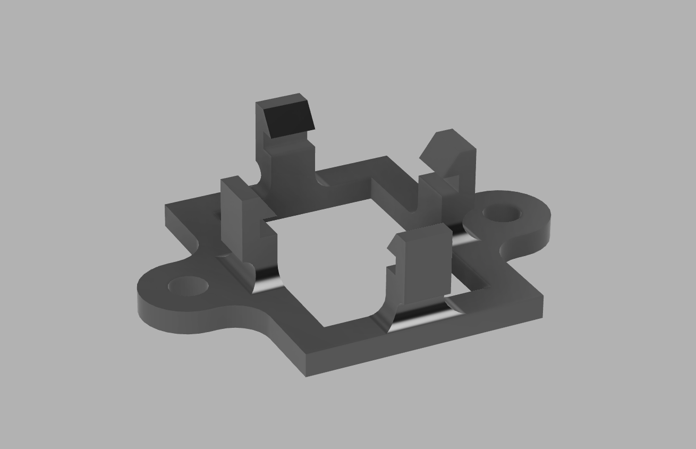
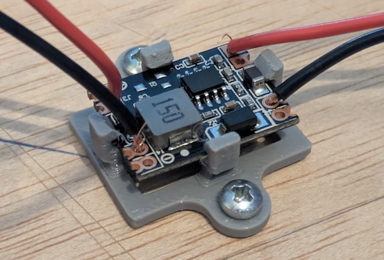

## 3D printed parts

Renovating this radio required designing and 3D printing a few parts (or at list, it made my life easier doing it and it is a new hobby I picked up 😉).

### 5v regulator board

The ESP32 and its peripherals are fed from the main PSU via a very small 5v regulator.  
This little bracket was printed from "tough" TPU ([Bambulab's AMS TPU](https://eu.store.bambulab.com/products/tpu-for-ams)). I do not write "tough" losely. It was my first TPU and it looks much much stiffer than what you can see on the internet for 85A or 90A shore TPU.

  <table>
  <tr>
    <td>
      
    </td>
    <td>
      
    </td>
  </tr>
  </table>

I had to redo this one a few times before I found the right material (PLA and PETG were too stiff and too brittle) and the right shape.

