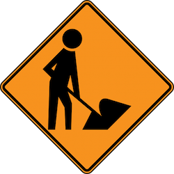
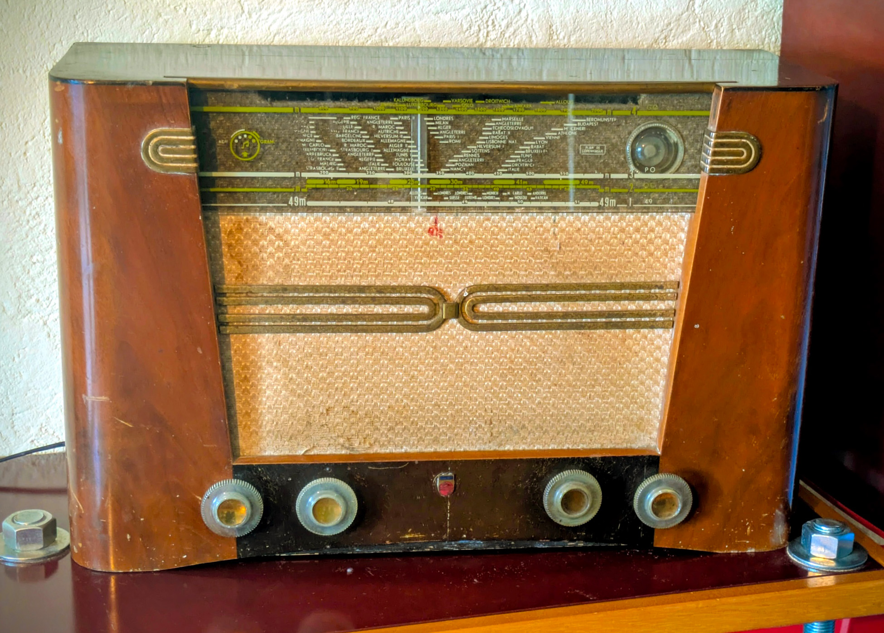

# esp32_dab_radio

This is an ESP 32 based audio sytem with FM & DAB+ radio support as well as Bluetooth.

   
  
   
  
    <strong>This is a work in progress!</strong>
  

## What shall it do?

### Form factor / controls

This is meant to be used to renovate a vintage radio.  
Therefore, the speakers, the number / type of buttons, the display have been choosen to fit the original cabinet.

### Sources

The system shall allow listening to:
- FM radio;
- DAB+ radio;
- Bluetooth audio source.

### Radio feature

The radio sub-system is based on a [DAB Shield board](https://www.dabshield.com/).

It shall allow listening to FM and DAB+ stations.  
It shall support memorizing stations.

### Bluetooth

There are 2 options for the Bluetooth:
- Use an amplifier module that support BT natively (for example, this [Dayton Audio](https://www.daytonaudio.com/product/1863/kabd-250-2-x-50w-all-in-one-amplifier-board-with-dsp-and-bluetooth-5-0-aptx-hd) module),
- Use the Bluetooth from the ESP 32 board.

### Audio sub-sytem
_TBD_

## Cabinet restoration

