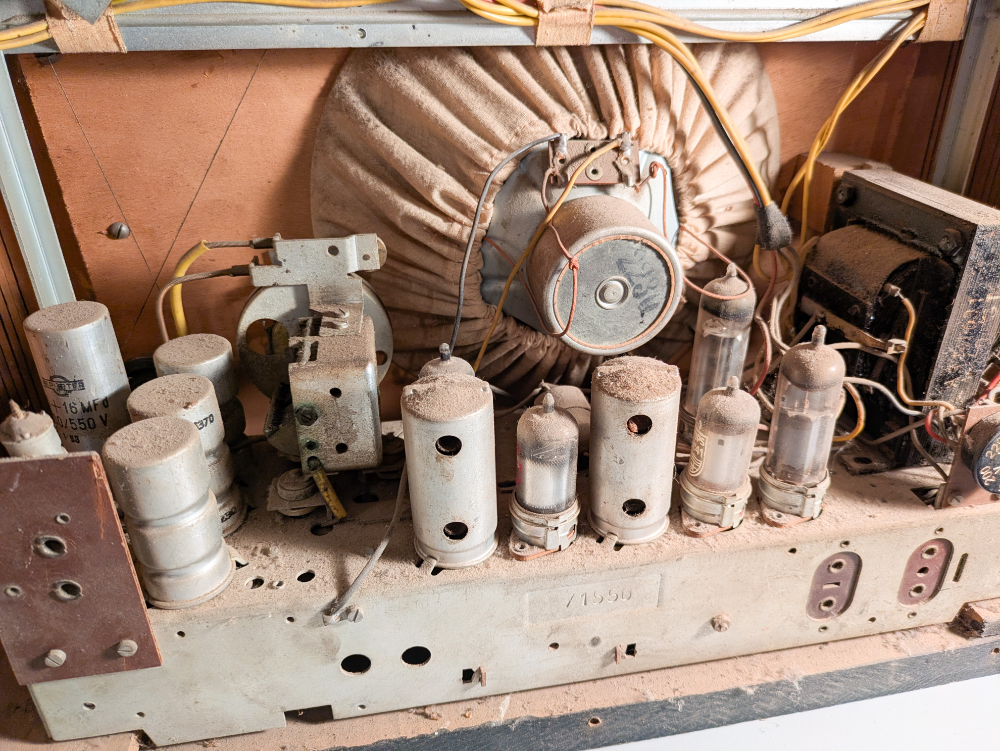
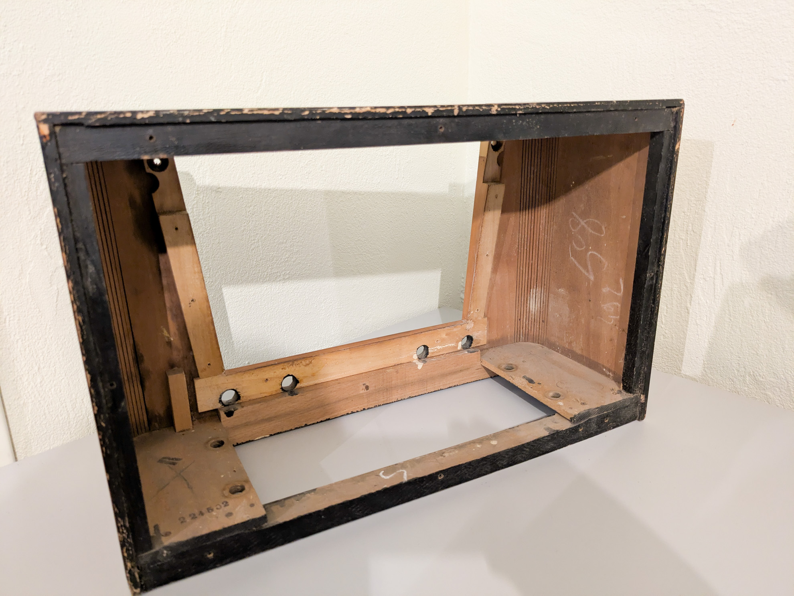
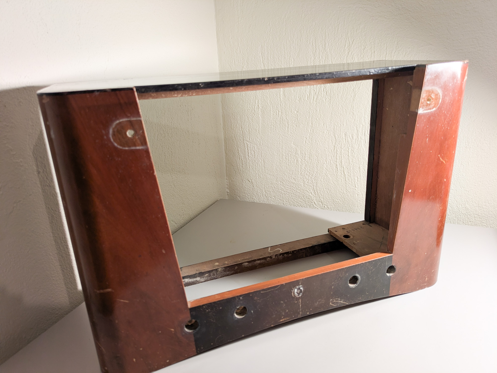
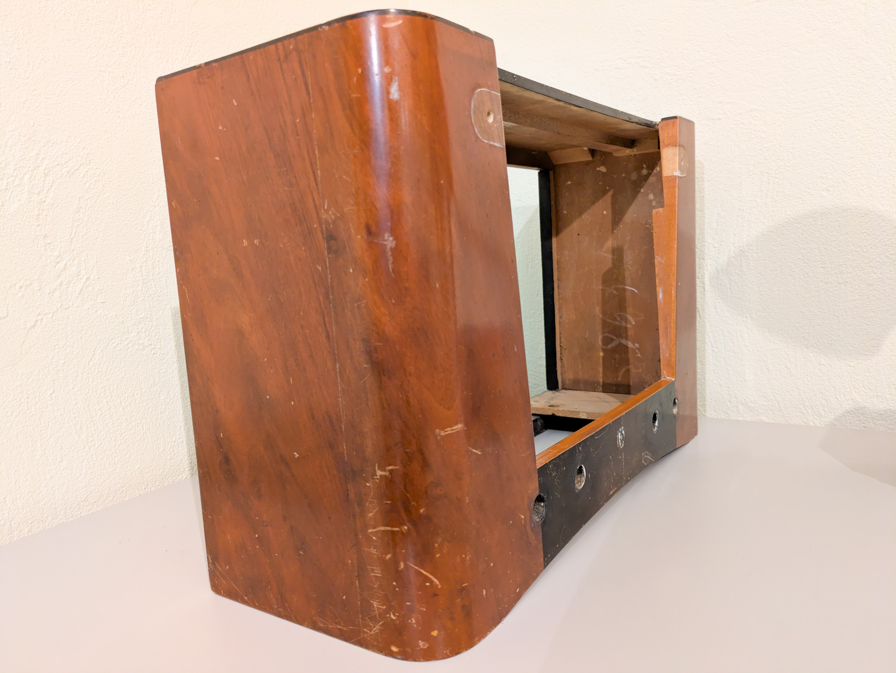
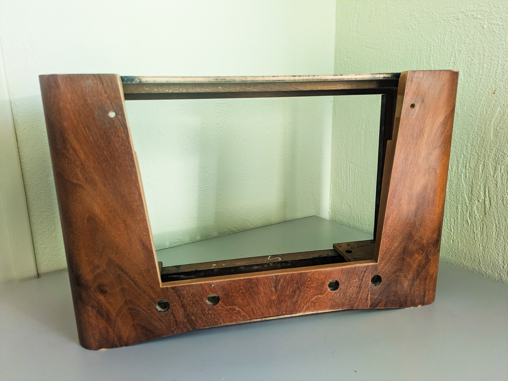
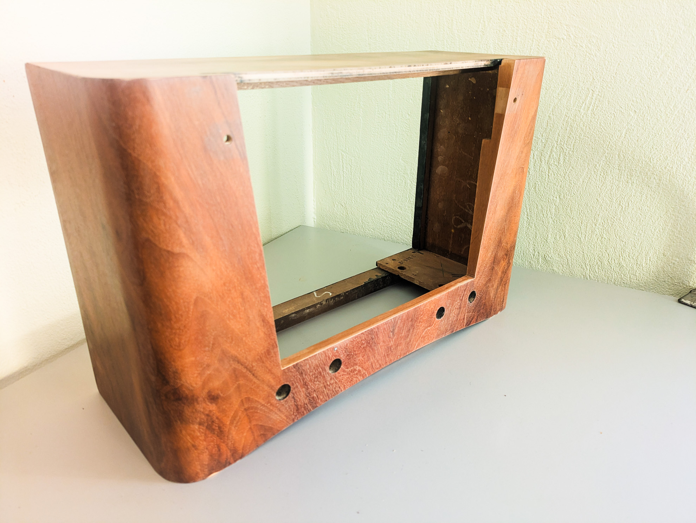

# Renovating the cabinet of the Philips BF501 vintage radio

## Original state

## Stage 1: Removing the old electronics

First stage was to remove the old electronic components from the cabinet.

## Stage 2: Sanding the cabinet

As the paint (top) and the varnish was showing a few bruises, I decided to redo them entirely.

I first sanded entirely the cabinet, removing all traces of the back "piano" laque on the top and the varnish that covered the nice walnut veneer.

After 3 hours of solid work, the result looks quite good.

  

  

Note: the top seems to be a different wood and I think I will paint it black as it was.