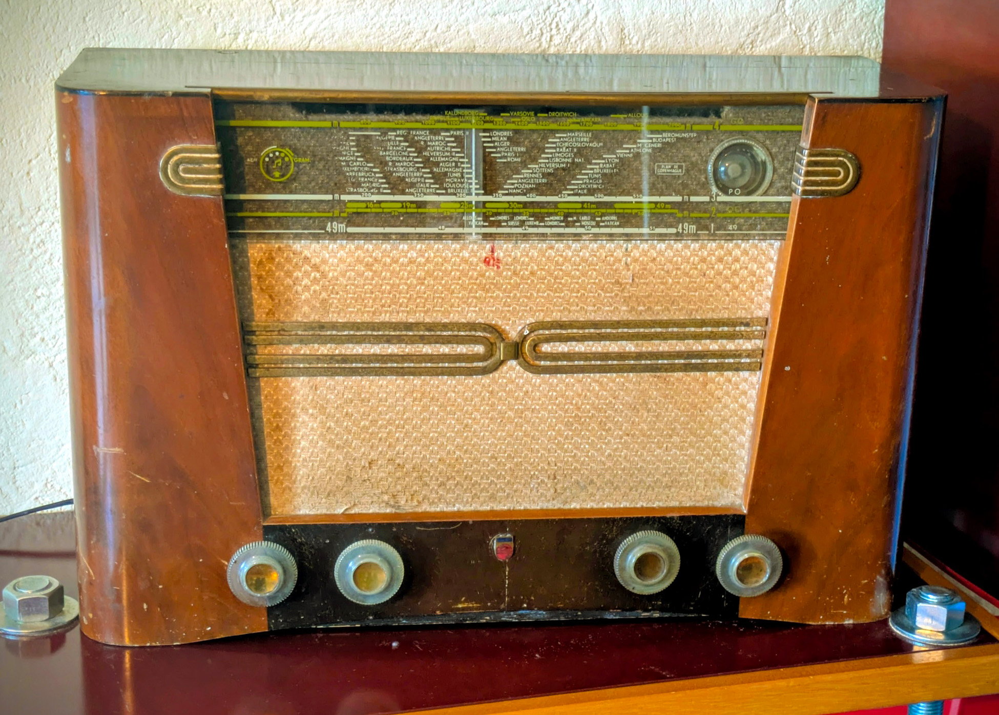

# What is it that we try to achieve?

## Form factor / controls

This is meant to be used to renovate a vintage radio.  
Therefore, the speakers, the number / type of buttons, the display have been choosen to fit the original cabinet.

## Sources

The system shall allow listening to:
- FM radio;
- DAB+ radio;
- Bluetooth audio source.

## Radio feature

The radio sub-system is based on a [DAB Shield board](https://www.dabshield.com/).

It allows listening to FM and DAB+ stations.  
It supports memorizing stations, finding existing staions thru the entire radio band and manual tuning (in the case of FM).

## Bluetooth

We are using the Wemos D1 R32 Bluetooth capability to offer a Bluetooth audio sink (AD2P).

This is achieved via the great [ESP32-AD2P](https://github.com/pschatzmann/ESP32-A2DP) library from [Phil Schatzmann](https://github.com/pschatzmann).

## Audio sub-sytem
_TBD_
